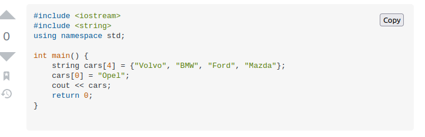

# Copy-Code

This is a code repository for the Browser extension which allows us to copy any code snippet from stackoverflow in a single click. If you want to learn how to write this , I have everything covered for you in this article : [https://www.freecodecamp.org/news/write-your-own-browser-extensions/](https://www.freecodecamp.org/news/write-your-own-browser-extensions/)

# Compatibility

Works in all browsers

# Usage

To use this extension locally in your machine.

Clone the repo Using terminal
```
git clone https://github.com/Abhilekhgautam/Copy-Code.git

```
For Firefox Users:
 go the address bar of your browser and type:
 
 ```
 about:debugging#/runtime/this-firefox
 
 ```
 Selct the `Load Temporary Addons`option and select the `manifest.json` file from the directory.
 
 Now,visit the stackoverflow site and you will see a `copy` button near any code snippet as
 
 
 
 You can see the `Copy button` easily which on click will copy the snippet to clipboard and alert you with the copied message
